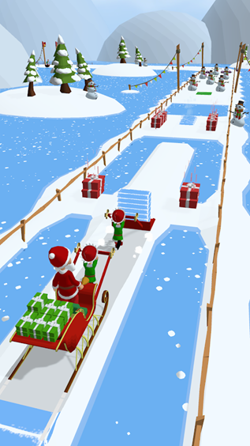
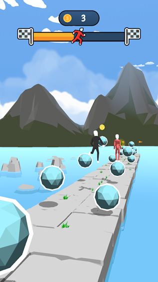
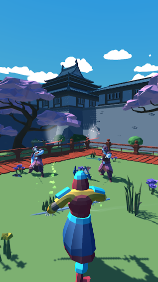

# 2048 Race - 08/21

**[Google Play](https://play.google.com/store/apps/details?id=com.GrigoryMelnikov.Race2048)**
- Code
- UI layout
- Level-design with Assets

# Synergy Kids - 05/21

**[Google Play](https://play.google.com/store/apps/details?id=com.synergy.kidsuniverse)**
- Code

# Swipe Cubes - 01/21

**[Google Play](https://play.google.com/store/apps/details?id=com.EvilepticGames.SwipeCubes)**

# Tup Tup - 01/21

**[Google Play](https://play.google.com/store/apps/details?id=com.EvilepticGames.TupTup)**

# Christmas Keeper - 12/20

**[Google Play](https://play.google.com/store/apps/details?id=com.ZlodeyStudios.ChristmasKeeper)**
- Game-design
- Code
- UI layout
- Level-design with Assets

# Sphere Jump - 10/20

**[Google Play](https://play.google.com/store/apps/details?id=com.ZlodeyStudios.SphereJump)**
- Code
- UI layout
- Level-design with Assets

# Saboteur! - 10/20

**[Google Play](https://play.google.com/store/apps/details?id=com.zlodeystudios.saboteur)**
- Code
- UI layout
- Level-design with Assets

# Ring Boy - 10/20

**[Google Play](https://play.google.com/store/apps/details?id=com.ZlodeyStudios.RingBoy)**
- A little bit of code
- UI layout
- Level-design

# Bad Fat Cat - 09/20

**[Google Play](https://play.google.com/store/apps/details?id=com.ZlodeyStudios.BadFatCat)**
- Game-design
- Code
- UI layout/artist
- VFX
- Level-design with Assets

# Slice Samurai - 08/20

**[Google Play](https://play.google.com/store/apps/details?id=com.zlodey.SliceSamurai)**
- Code
- UI layout/artist
- VFX

